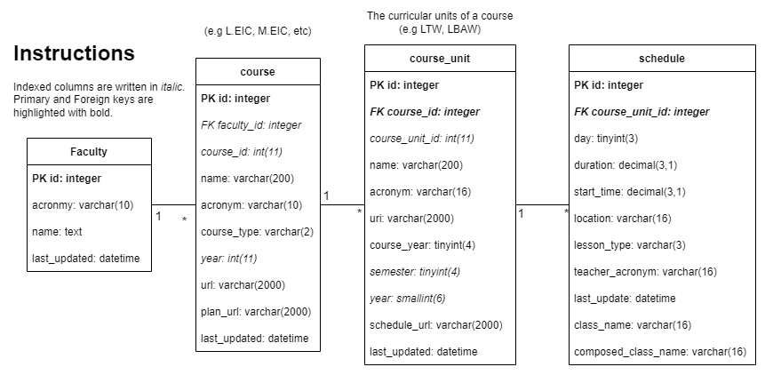

# University of Porto Scrapper - *UPS!*
Python solution to extract the courses schedules from the different Faculties of University of Porto.

## Requirements
- docker-ce
- docker-compose
**or** 
- python >=3.8
- make 

**If you don't have docker**, you can use python locally in your machine **or** create a virtual environment. In this case make sure python version is `>=3.8`. 

### Local python 
```bash
pip install -r ./scr/requirements.txt   # Install dependencies
```

### Virtual environment
```bash 
python -m venv venv_scrapper            # Create virtual environment
source ./venv_scrapper/bin/activate        # Activate virtual environment
pip install -r ./src/requirements.txt   # Install dependencies
```


## Quick start

### :wrench: Configure
Change the following fields in `./src/config.ini`: 
- `USER`: replace with your `up` number (e.g `up201812345`).
- `YEAR`: replace with the year you want to scrap (e.g. 2022 is for the 2022/2023 school year).

```ini
[default]
YEAR=2022
USER=up201800175
```

### :dash: Run
- Gathering data: 
```bash
docker-compose run scrapper make
# or 
cd ./src && make
```

- Dumping data:
```bash
docker-compose run scrapper make dump
# or 
cd ./src && make dump
```

- Upload data to temporary online storage:
```bash
docker-compose run scrapper make upload
# or 
cd ./src && make upload
```

- Clean database: 
```bash
docker-compose run scrapper make clean
# or
cd ./src && make clean
```


## :mag: Inspect 

To inspect the scrapy engine, use `scrapy shell "url"`

Example:
```
root@00723f950c71:/scrapper# scrapy shell "https://sigarra.up.pt/fcnaup/pt/cur_geral.cur_planos_estudos_view?pv_plano_id=2523&pv_ano_lectivo=2017&pv_tipo_cur_sigla=D&pv_origem=CUR"
2017-10-24 20:51:35 [scrapy.utils.log] INFO: Scrapy 1.4.0 started (bot: scrapper)
...
>>> open('dump.html', 'wb').write(response.body)
63480
>>> response.xpath('//*[@id="anos_curr_div"]/div').extract()
```

## :triangular_ruler: Database design 




## :page_with_curl: More information 
- This repository contains useful scripts. Check the  `./src/scripts` folder. 
- For some information of how the `sqlite3` database is generated check the `./src/scrapper/database/dbs` folder. 
- Configurations can be done in the `./src/config.ini` file. 
